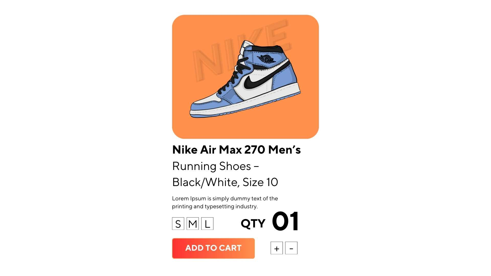

With millions of products dying for attention online, crafting optimized product titles isn’t just a best practice; it’s a necessity.

But why are product titles so critical for e-commerce SEO? The answer is simple: they help search engines understand what you’re selling and ensure your products appear in relevant searches. More importantly, they influence whether a potential customer clicks on your product or scrolls past it.

At **CLOUD9**, we know that every detail matters when it comes to driving traffic and conversions. In this guide, we’ll walk you through actionable strategies to create product titles that not only rank well but also resonate with your audience.

## What Makes a Great Product Title?
A product title is more than just a name—it’s a concise yet informative description of what you’re selling. It should include key details like the brand, product type, size, color, and any other relevant attributes. But it’s not just about stuffing keywords; it’s about creating a title that’s both search-engine-friendly and customer-friendly.

### Example of an optimized product title:

**Nike Air Max 270 Men’s Running Shoes – Black/White, Size 10**  
This title is clear, descriptive, and includes essential keywords that shoppers are likely to search for.

## How to Write SEO-Friendly Product Titles

### Start with the Most Important Keywords
Your primary keyword should appear at the beginning of the title. This is because search engines prioritize the first few words, and shoppers tend to scan titles quickly. For example, if you’re selling a wireless Bluetooth speaker, start with **“Wireless Bluetooth Speaker”** rather than burying it in the middle.

At **CLOUD9**, we use advanced keyword research tools to identify high-performing keywords that align with your target audience’s search intent. This ensures your titles are optimized for both visibility and relevance.

### Be Specific and Descriptive
Generic titles like **“Blue Dress”** won’t cut it. Instead, include specific details like the brand, material, size, color, and style. For example:

**“Calvin Klein Women’s Slim Fit Mid-Length Dress – Navy Blue, Size 8”**

This not only helps with SEO but also gives shoppers a clear idea of what they’re buying.

### Keep It Concise
While it’s important to be descriptive, avoid making your titles too long. Aim for **50-70 characters** to ensure they display properly on search engines and marketplaces like Amazon or eBay.

### Highlight Unique Selling Points (USPs)
What makes your product stand out? Is it eco-friendly, on sale, or available for fast shipping? Incorporate these USPs into your title to grab attention. For example:

**“Eco-Friendly Bamboo Cutting Board – Sustainable, Durable, and Dishwasher Safe”**

### Use Numbers and Symbols Wisely
Numbers and symbols can make your titles more eye-catching. For instance:

**“50% Off Samsung Galaxy S23 Ultra – Limited Time Offer”**

This creates a sense of urgency and encourages clicks.

### Avoid Keyword Stuffing
While keywords are important, overloading your title with them can make it sound unnatural and spammy. Focus on readability and relevance.

## Best Practices for E-commerce Product Titles

- **Use Consistent Formatting**: Stick to a clear and consistent structure across all your product titles. This not only improves SEO but also enhances the user experience.
- **Leverage Brand Recognition**: If your brand is well-known, include it in the title to build trust and credibility.
- **Optimize for Mobile**: Many shoppers browse on mobile devices, so ensure your titles are concise and easy to read on smaller screens.
- **Test and Iterate**: Use tools like Google Analytics and A/B testing to evaluate the performance of your titles. Experiment with different formats and keywords to see what works best.

## Why Product Titles Matter for Your E-commerce Strategy
Product titles are a critical component of your e-commerce SEO strategy. They not only help your products rank higher in search results but also influence click-through rates and conversions. By optimizing your titles, you can:

- Improve visibility on search engines and marketplaces.
- Attract more qualified traffic to your product pages.
- Enhance the shopping experience by providing clear and relevant information.

At **CLOUD9**, we specialize in crafting data-driven strategies that deliver results. Whether you’re a small business or a global brand, we’ll help you optimize every aspect of your e-commerce presence to drive growth and success.

## Ready to Elevate Your E-commerce Game?
Optimizing product titles is just the beginning. At **CLOUD9**, we combine cutting-edge technology, creative expertise, and a deep understanding of consumer behavior to help your brand thrive in the digital landscape.

[Get in touch with us today](/contact) to learn how we can transform your e-commerce strategy and take your business to new heights.
