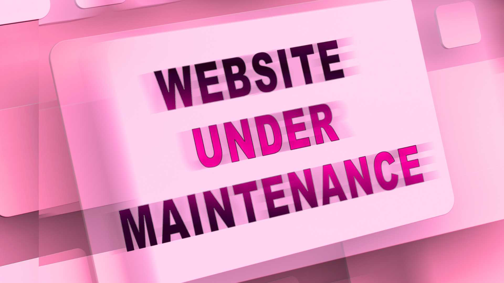
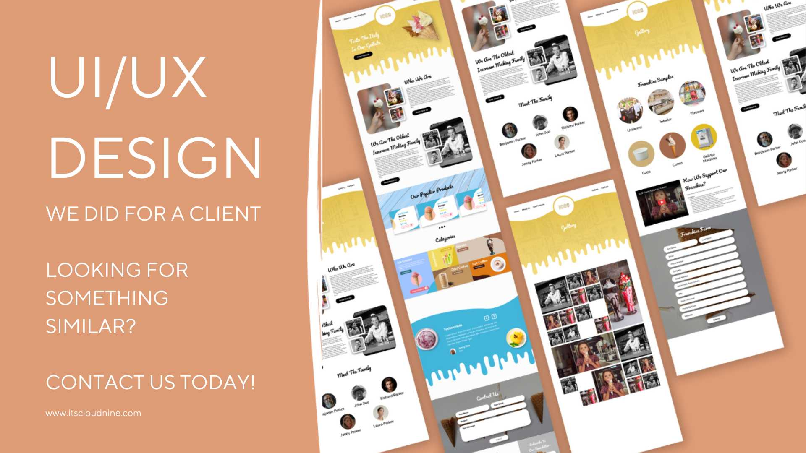

Redesigning your website is more than just a visual upgrade—it’s a chance to reinvent your brand, captivate your audience, and supercharge your business growth. Imagine your website as the digital front door to your brand. Is it inviting, engaging, and compelling? Or does it feel outdated, cluttered, and uninspiring? A well-executed redesign can turn visitors into loyal customers and breathe new life into your online presence.

At **Cloud Nine**, we believe a website redesign is not just a project—it’s a digital transformation. Every pixel, every interaction, and every content element should serve a purpose. As a top digital marketing agency, we understand the importance of aligning your website with your broader online marketing services strategy. Let’s dive into the roadmap that will make your redesign a soaring success.

## Why Redesign Your Website?

Before you roll up your sleeves, let’s get clear on why a redesign is essential. Some common (and crucial) reasons include:

- **Poor Performance**: If your site is sluggish, struggles with traffic, or fails to convert visitors, it’s time for a change.
- **Outdated Aesthetics**: A dull, outdated website can make your brand look behind the times.
- **Mobile Responsiveness**: If your site isn’t a smooth experience on mobile devices, you’re losing potential customers.
- **Evolving Business Goals**: If your brand, audience, or services have changed, your site should reflect that evolution.
- **Lack of SEO Services Integration**: If your site isn’t optimized for search engines, you’re missing out on valuable organic traffic.

A website redesign isn’t just about aesthetics; it’s about creating a digital experience that wows visitors and fuels your business success.

## Benchmark Your Current Performance

Before reinventing the wheel, analyze what’s working and what’s not. A well-planned **search engine optimization (SEO) strategy** starts with measuring key performance indicators like:

- **Traffic Flow**: How many visitors land on your site daily?
- **Engagement Levels**: Are users sticking around, or bouncing away within seconds?
- **Conversion Rates**: Are visitors turning into customers?
- **Google Ranking Services Effectiveness**: Are your pages ranking high or lost in search engine results?

This data-driven approach ensures that your redesign efforts are focused on meaningful improvements, not just a fresh coat of paint.

## Dive Deep into Research

The secret to a successful redesign? Knowing your audience inside and out. Here’s how:

### 1. Audience Insights
Step into your users' shoes. What are their pain points? What inspires them to take action? Conduct surveys, interviews, and analyze behavioral data to build a crystal-clear user persona.

### 2. Spy on Competitors
Take a peek at what your competitors are doing. What are they nailing? Where are they missing the mark? Learn from their successes and failures to craft a strategy that sets you apart.

### 3. Master the Search Landscape
SEO is your secret weapon. Use tools like **Semrush, Google Keyword Planner**, or **Cloud Nine’s analytics platform** to uncover keyword trends, content gaps, and ranking opportunities. A strong **lead generation services** and **online advertising services** strategy will make your redesigned site an unstoppable force.

## Revamp Your Content Strategy

A stunning design is nothing without impactful content. Conduct a content audit and evaluate:

- **Relevance**: Is the content fresh, engaging, and valuable?
- **Performance**: Does it drive traffic and conversions?
- **SEO Power**: Are your pages ranking for the right keywords?

A successful **content marketing services** strategy keeps what works, refreshes outdated content, and eliminates anything that no longer aligns with your brand. Your website should be a **library of value** for your visitors.

## Craft a Killer Site Structure

Your website’s blueprint should make navigation seamless. Think of it as a digital roadmap guiding users to their destination with ease. A well-structured website supports **conversion rate optimization** by:

- **Clearly Defining Page Hierarchies**
- **Simplifying Navigation for a Frictionless Experience**
- **Highlighting Key Pages for Maximum Impact**

Effective **website design and development** ensures that users can find the information they need without frustration.

## Elevate User Experience (UX)

A gorgeous website is meaningless if users can’t navigate it effortlessly. Testing the **UX/UI design** ensures that your audience enjoys a frustration-free experience. A clear **digital marketing strategy** prioritizes user interaction, ensuring that **landing page optimization** and **social media content strategy** align with the website experience.

## Choose the Perfect CMS

Your **Content Management System (CMS)** is your website’s engine. Choose wisely! Consider factors like:

- **Ease of Use**: Can your team update content effortlessly?
- **Scalability**: Will it grow with your business?
- **SEO Friendliness**: Does it support on-page optimization?

Popular choices include **WordPress, Shopify, and Adobe Commerce**. If your business relies on **eCommerce SEO**, ensure your CMS supports advanced **technical SEO specialists** configurations.

## Design & Develop Like a Pro

Now, let’s bring your vision to life! A **mobile-first design** approach ensures that your site is optimized for all devices. Stick to these principles:

- **Speed Optimization**: Compress images, leverage caching, and use a CDN for lightning-fast load times.
- **SEO Best Practices**: Implement strategic keywords, meta tags, and structured data.
- **Accessibility Standards**: Ensure your site meets **ADA and WCAG** guidelines for inclusivity.

A **digital marketing agency** with **website design and development expertise** can fine-tune these elements for maximum efficiency.

## Partner with the Right Agency

A successful redesign is a team effort. Working with a **top digital marketing firm** ensures that your project is executed with expertise. If you’re searching for **branding and digital strategy specialists**, choose an agency with:

- **A Strong Portfolio**
- **Client Testimonials & Reviews**
- **A Deep Understanding of Your Business Goals**

## Launch, Monitor, and Optimize

Congratulations, your new website is live! But the work isn’t over. Post-launch, focus on:

- **Tracking Key Metrics**: Are you seeing increased traffic and engagement?
- **A/B Testing**: Experiment with different elements to optimize conversions.
- **Content Updates**: Keep your site fresh with regular updates.

A strong **email marketing solution** and **social media marketing agency** support can amplify your reach and engagement.

## The Power of a Game-Changing Redesign

A well-planned website redesign isn’t just about aesthetics—it’s about impact. By following this roadmap, you’ll create a site that captivates visitors, drives conversions, and positions your brand as a leader in your industry. 

Your website is more than a digital space—it’s your **lead-generating powerhouse, your 24/7 online advertising service, and your corporate branding solution**. Ready to turn it into your biggest asset? Let **Cloud Nine** help you soar! 🚀
